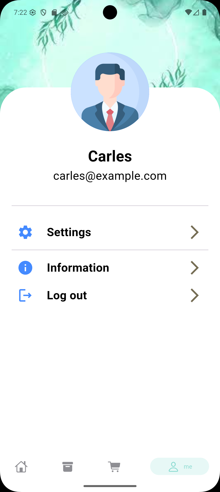
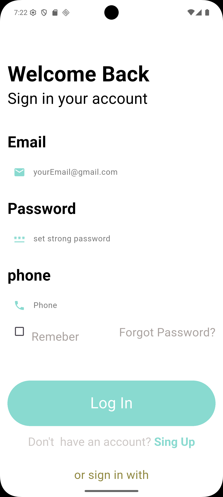
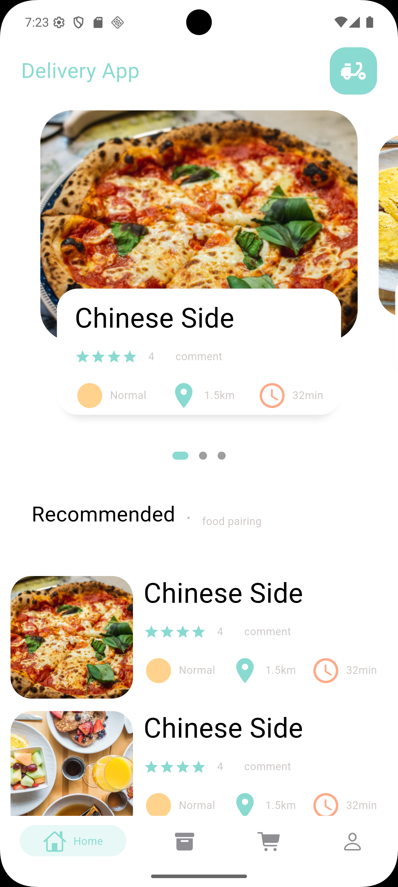

# Delivery App - Flutter Edition 🚀

A high-performance, full-stack delivery application built with **Flutter** and **GetX**. This project demonstrates advanced UI design, state management, and a seamless user experience tailored for modern mobile commerce.

## 📱 Features
* **Authentication**: Secure login and signup flow using local JSON data for rapid prototyping.
* **State Management**: Reactive UI updates powered by the GetX library.
* **Responsive Design**: Custom dimension utilities to ensure a consistent look across various screen sizes.
* **User Profile**: Dynamic account management with persistent data handling.
* **Dark Mode Support**: Context-aware UI elements that adapt to system themes.

## 🛠 Tech Stack
* **Frontend**: Flutter (Dart)
* **State Management**: GetX
* **Local Data**: JSON Asset Bundling
* **Styling**: Custom CSS-like utilities for Flutter

## 📸 Screenshots
|                  Profile Page                   |                Sign In                 |                Main Page                |
|:-----------------------------------------------:|:--------------------------------------:|:---------------------------------------:|
|  |  |  |

## 🚀 Getting Started

### Prerequisites
* Flutter SDK (Latest Version)
* Android Studio / VS Code
* Dart 3.x

### Installation
1. **Clone the repository**:
   ```bash
   git clone [https://github.com/YourUsername/delivery_app_new.git](https://github.com/YourUsername/delivery_app_new.git)
2. **Navigate to the project folder**:
   ```bash
   cd delivery_app_new

3.**Install dependencies**:
   ```bash 
   flutter pub get
